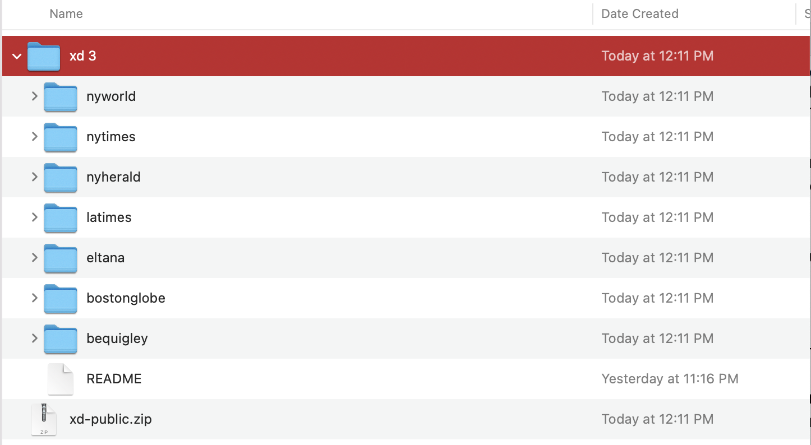
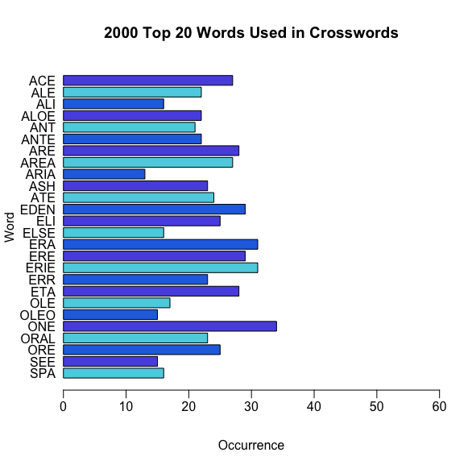
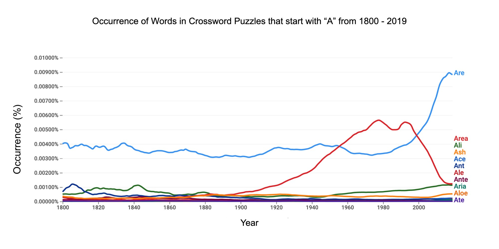
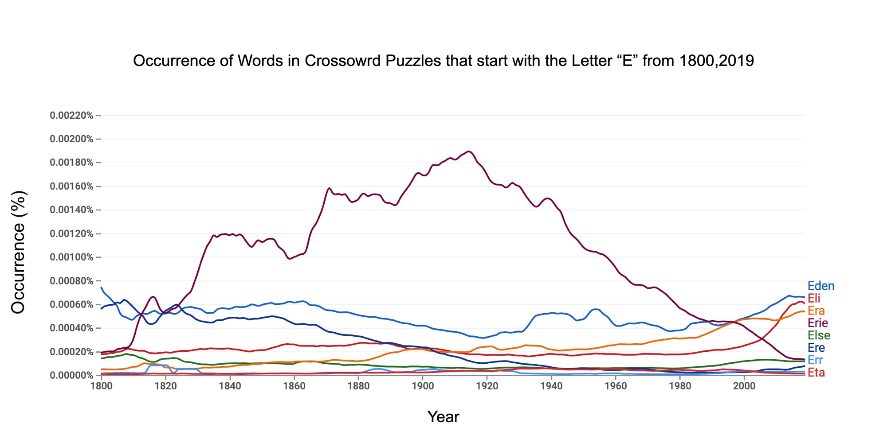

### Step 1: Choose a Dataset

**My interest in the topic**

I chose the topic of New York Times Crossword Puzzle Dataset because I myself had written crossword puzzles while developing Crossword AR (Augmented Reality) for iOS. While searching YouTube videos on how to make a crossword puzzle, the very first video in my search was of David Kwong, a New York Times Cruciverbalist or constructor of crossword puzzles. David went through the intricacies that go into making a crossword puzzle; always making sure the rules of puzzle making were respected. The beginning of any crossword is very simple but I learned as I progressed through filling in the words, I found myself desperately applying abbreviations, acronyms, and even words in foreign languages (foreshadowing). To my relief, I found a website that charged around $5 per month to generate crossword puzzles based on a set of words that I inputed into the program.

**The Result**

I finally launched Crossword AR, an Augmented Reality game where users could scroll through clues and select letters that appear to fall out of the sky and onto the puzzle board. Due to a vigorous schedule between work, school and family, I've neglected updating the application but look forward to working on the source code over the holiday break.

**Second Data Source Link**

    https://xd.saul.pw/data/

**Link to the Original Source of the Data**

There is no cited link to the original source of data which is referred to by the author as, "daily crosswords from several sources..." by the author. Based on similar .zip files created by the author and the names of those files and the data within them, the original sources were Crossword Puzzles created by New York World, New York Times, New York Herald, LA Times, Eltana, Boston Globe and B.E. Quigley.

### Step 2: Start the EDA Process

**Questions**

*Original Questions*

* Why is the letter "X" used at a higher rate in the month of February?

* Why is the letter "Q" used at a higher rate in the month of October?

After my initial analysis of the visualization idioms used to show the occurrence of the letters "X" and "Q" by month, the data remained relatively consistent with only one month as a slight exception. After receiving valuable input from my Professor on the direction I should take, I decided to gather data on the occurrence of specific words used in Crossword Puzzles that had the greatest frequency by year. Since "X" and"Q" were not included in the list of top twenty most frequently used words, I decided to use the letters "A" and "E". This lead me to my final questions that

*Final Detailed Questions* 

* Which words that begin with the letter "A" occur most often in Crossword Puzzles created in the past 30 years?

* Which words that begin with the letter "E" occur most often in Crossword Puzzles created in the past 30 years?
    
**Data Cleaning**

The first step in cleaning the data in preparation for visualization is to import the dataset into the project. I dragged the downloaded file into the Project folder on my Desktop and began to read the data.

    CROSSWORD2 <- read.csv("clues.csv", stringsAsFactors = FALSE)

Next, I was unable to immediately visualize the data in a simple histogram so I converted the dataset into a list in order to view any gaps in the data. The histogram was then used to identify the number of cells with data by year.

     CROSSWORD2.TABLE <- list()
     hist(CROSSWORD2$year[CROSSWORD2$year>1900], main="Quantity of Cells Used in Dataset by Year", horizontal=FALSE, xlab="Year",     
     ylab="Quantity", col= c("#5BD1E2","#5B57E2","#2571E2"))

I noticed that the the majority of the data present was gathered from 1995-2019 so I filter the year from 1995 to 2019.

      hist(CROSSWORD2$year[CROSSWORD2$year>1995], main="Quantity of Cells Used in Dataset by Year", horizontal=FALSE, xlab="Year", 
      ylab="Quantity", col= c("#5BD1E2","#5B57E2","#2571E2"))

I continued to explore the answers column and filtered by the year 2000 and named the new dataset "CROSSWORD2.COMMON".

    CROSSWORD2.COMMON <- CROSSWORD2$answer[CROSSWORD2$year==2000]

The dataset was then converted into a table by using the table() function which returns a contingency table of containing an array of integers. Next, the data was paced back into rows and columns using the data.frame() function. The cells were then coverted to characters. Finally, the array was sorted in descending order.

    CROSSWORD2.TABLE[[1]] <- table(CROSSWORD2.COMMON)
    CROSSWORD2.TABLE[[1]] <- data.frame(CROSSWORD2.TABLE[[1]], stringsAsFactors = FALSE)
    CROSSWORD2.TABLE[[1]]$CROSSWORD2.COMMON <- as.character(CROSSWORD2.TABLE[[1]]$CROSSWORD2.COMMON)
    CROSSWORD2.TABLE[[1]] <- arrange(CROSSWORD2.TABLE[[1]], desc(Freq))

This process was repreated with the above code with the only difference being the year 2001 for which a comparison was made.

    CROSSWORD2.COMMON <- CROSSWORD2$answer[CROSSWORD2$year==2001]
    CROSSWORD2.TABLE[[2]] <- table(CROSSWORD2.COMMON)
    CROSSWORD2.TABLE[[2]] <- data.frame(CROSSWORD2.TABLE[[2]], stringsAsFactors = FALSE)
    CROSSWORD2.TABLE[[2]]$CROSSWORD2.COMMON <- as.character(CROSSWORD2.TABLE[[2]]$CROSSWORD2.COMMON)
    CROSSWORD2.TABLE[[2]] <- arrange(CROSSWORD2.TABLE[[2]], desc(Freq))

Limits were placed on the dataset in order to access the first 20 words only.

    CROSSWORD2.COMMON.WORDS <- rbind(CROSSWORD2.TABLE[[1]][1:20,],CROSSWORD2.TABLE[[2]][1:20,])

The unique() function was used to remove duplicates elements and rows.

    WORDS <- unique(CROSSWORD2.COMMON.WORDS$CROSSWORD2.COMMON[CROSSWORD2.COMMON.WORDS$CROSSWORD2.COMMON!=""])

The data in the dataset was converted to the type character.

    WORDS <- as.character(WORDS)

**Visualization Idioms**

*Horizontal Bar chart 1*

To visualize the horizontal bar chart, further cleaning is necessary. First, the y-axis is set to "answers" and the x-axis is set to "year".

    COMPOSITE.2000 <- CROSSWORD2$answer[CROSSWORD2$year==2000]
    COMPOSITE.2000 <- COMPOSITE.2000[COMPOSITE.2000 %in% WORDS]
    COMPOSITE.2000 <- table(COMPOSITE.2000)
    COMPOSITE.2000 <- data.frame(COMPOSITE.2000)
    COMPOSITE.2000$COMPOSITE.2000 <- as.character(COMPOSITE.2000$COMPOSITE.2000)
    COMPOSITE.2000 <- arrange(COMPOSITE.2000, desc(COMPOSITE.2000))

The final step in visualizing the horizontal bar chart is to use the function barplot(), set the title (main), labels (xlab,ylab), bar colors (col= c()) using hexadecimal, adjust the x-axis limits (xlim) and adjust the position of the x and y axis labels (mgp=c()).

    barplot(COMPOSITE.2000$Freq, las=1, horiz = TRUE, names.arg = COMPOSITE.2000$COMPOSITE.2000, col= c("#5BD1E2","#5B57E2","#2571E2"), 
    main="2000 Top 20 Words Used in Crosswords", horizontal=FALSE, xlab="Occurrence", ylab="Word", xlim=c(0,60), mgp=c(3,.5,0))

*Horizontal Bar chart 2*

The same procedure applied above was performed for the second horizontal bar chart visualizing the same set of words from the year 2001.

    COMPOSITE.2001 <- CROSSWORD2$answer[CROSSWORD2$year==2001]
    COMPOSITE.2001 <- COMPOSITE.2001[COMPOSITE.2001 %in% WORDS]
    COMPOSITE.2001 <- table(COMPOSITE.2001)
    COMPOSITE.2001 <- data.frame(COMPOSITE.2001)
    COMPOSITE.2001$COMPOSITE.2001 <- as.character(COMPOSITE.2001$COMPOSITE.2001)
    COMPOSITE.2001 <- arrange(COMPOSITE.2001, desc(COMPOSITE.2001))

    barplot(COMPOSITE.2001$Freq, las=1, horiz = TRUE, names.arg = COMPOSITE.2001$COMPOSITE.2001, col= c("#133ADE","#813ADE","#ED3ADE"), 
    main="2001 Top 20 Words Used in Crosswords", horizontal=FALSE, xlab="Occurrence", ylab="Word", xlim=c(0,60),mgp=c(3,.5,0))

Subsets of the top 20 most frequently used words in Crossword Puzzles was applied to Google's NGram Generator which displays a timeline of words used over time from 1800 to 2019. Words with the letter "A" are first visualized.

Next, all of the words beginning with the letter "E" were inputed into the NGram generator.

**Observations**

**Interest Findings**

**Full Explanation of Analysis**

**Reference**

* Download Crossword Data, https://xd.saul.pw/data/
* Google Books Ngram Viewer, https://books.google.com/ngrams/
* In R base plot, move axis label closer to axis, https://stackoverflow.com/questions/30265728/in-r-base-plot-move-axis-label-closer-to-axis
* Table function, https://www.rdocumentation.org/packages/base/versions/3.6.2/topics/table
* Unique Function, https://www.rdocumentation.org/packages/base/versions/3.6.2/topics/unique
* Character Function, https://www.rdocumentation.org/packages/base/versions/3.6.2/topics/character
