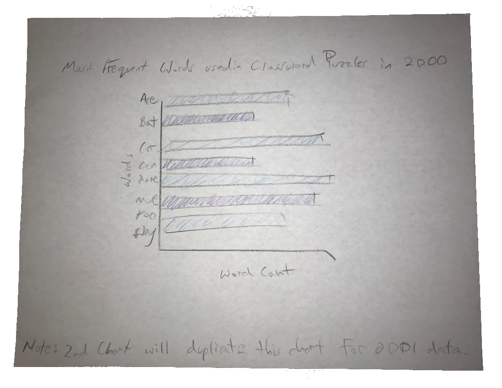
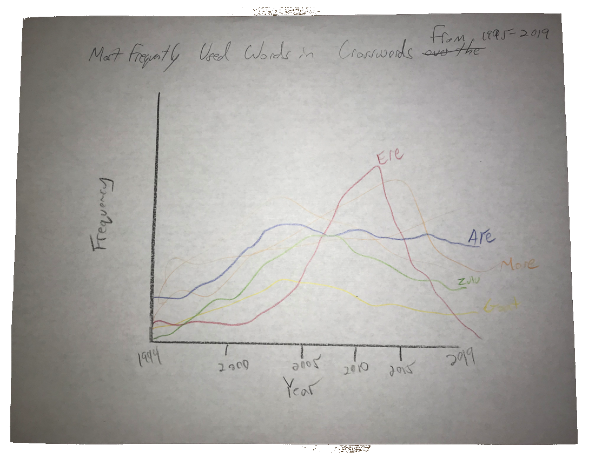

## Description of the EDA Process

**Generate Questions about your Data**

When brainstorming about questions I wanted to solve about my data, they are entirely oriented around what the Crossword Enthusiast would want to use as a tool to assist them in solving a Crossword Puzzle. Simply put, I created questions that somebody solving a Crossword Puzzle would be delighted to have answered.

**Search for answers by visualizing, transforming, and modeling your data**

I began to model the data with a histogram of the "clues.csv" dataset and transformed the data into top words used in Crossword Puzzles by year. Ultimately, the most relevant data I find will be the newest available to a reader unless the Cruciverbalist decided to design the Puzzle with historical words in mind.

**Use what you learn to refine your questions and/or generate new questions**

After several attempts at creating questions to visualize data from modified datasets, I ultimately concluded that it would be in the best interests of the user of the visualization idioms (also known as the Crossword Enthusiast or Solver of Crossword Puzzles) to refine questions that help the Crossword Enthusiast solve Crossword Puzzles.

**Description of your Datasets**

The datasets are a collection of some of the most popular Crossword Puzzles waiting to be solved. These Puzzles are designed by popular Crossword Puzzles gathered by the Author. For the most part, they contain a date, clue and answer to published Crossword Puzzles. Some datasets are organized in columns and rows while others are listed in a document that is difficult to edit.

## Second Data Source Link

    https://xd.saul.pw/data/
    
All of the datasets that were found through the link above were explored and a few of the subfolders were viewed. The data itself containing the clues and answers to many popular news publications were present but the format in which to extract and organize the data is beyond the scope of this courses. I made several attempts to individually create the dataset in an excel spreadsheet but found that I would have to copy each word one by one and paste them into individual cells. This process would take a little over eight days without any breaks or sleep (700,000 columns x 3 seconds per copy & paste / (60 seconds x 60 minutes x 24 hours)). Therefore, I decided to work with the data that was already organized into a .tsv file in the source link. I then converted it to a .csv file and imported "clues.csv" into R Studio.

## Link to the Original Source of the Data

There is no cited link to the original source of data which is referred to as "daily crosswords from several sources" by the author. It is, however, mentioned that the author collected the data himself by extracting data from individual crossword puzzles the Author chose to collect data from. Based on similar.zip files created by the author and the names of those files and the data within them, the original sources were Crossword Puzzles created by New York World, New York Times, New York Herald, LA Times, Eltana, Boston Globe and B.E. Quigley.

## Explore the Data, Additional Questions

The first step in exploring the data is to import the dataset into the project. I dragged the downloaded file into the Project folder on my Desktop and began to read the data.

    CROSSWORD2 <- read.csv("clues.csv", stringsAsFactors = FALSE)

Next, I was unable to immediately explore the data in a simple histogram so I converted the dataset into a list in order to view any gaps in the data. The histogram was then used to identify the number of cells with data by year.

     CROSSWORD2.TABLE <- list()
     hist(CROSSWORD2$year[CROSSWORD2$year>1900], main="Quantity of Cells Used in Dataset by Year", horizontal=FALSE, xlab="Year",     
     ylab="Quantity", col= c("#5BD1E2","#5B57E2","#2571E2"))

I noticed that the the vast majority of data present was gathered from 1995-2019 so I filtered the years from 1995 to 2019.

      hist(CROSSWORD2$year[CROSSWORD2$year>1995], main="Quantity of Cells Used in Dataset by Year", horizontal=FALSE, xlab="Year", 
      ylab="Quantity", col= c("#5BD1E2","#5B57E2","#2571E2"))

Now that I determined which years the bulk of the data was located in, I concentrated on visualizing the words themselves rather than individual letters which resulted in few interesting findings. 

## Final Detailed Questions

 The following are the original questions submitted in Homework 6:

* Why is the letter "X" used at a higher rate in the month of February?

* Why is the letter "Q" used at a higher rate in the month of October?

After my initial analysis of the visualization idioms used to show the occurrence of the letters "X" and "Q" by month, the data remained relatively consistent with only one month as a slight exception. After receiving valuable input from my Professor on the direction I should take, I decided to gather data on the occurrence of specific words used in Crossword Puzzles that had the greatest frequency by year. Since "X" and "Q" were not included in the list of top twenty most frequently used words, I decided to use the letters "A" and "E". This lead me to my final detailed questions:

* Which words that begin with the letter "A" or "E" occur most often in Crossword Puzzles between 2000 annd 2001?

* What are the most frequently used words in Crossword Puzzles over the past 25 years?

## Images of my Sketches

## Explanations of the charts

The chart used for the year 2000 and 2001 will clearly show which words are used most frequently in Crossword Puzzles from the period 1995 to 2019. There are limitations to my datasets which limit me to expanding on any elaborate theories as to why certain words are used in greater detail than others. The simple fact is that the English language evolves over time to where society uses more words than others. Put simply, the charts show words that are most commonly used in Crosswords from 1995 to 2019 which can be used by Cruciverbalists to create Crossword Puzzles as well as by Crossword enthusiasts who enjoy solving them. Any enthusiast that seeks additional clues to solve a puzzle may utilize these charts as a reference for words with the greatest probability to occur. 

## Reference

* Download Crossword Data, https://xd.saul.pw/data/
* Calling Bullshit, https://www.callingbullshit.org/index.html, UW iSchool: YouTube, https://www.youtube.com/channel/UCFdfsaSlsyTAYJvktJ53Qcg

* Google Books Ngram Viewer, https://books.google.com/ngrams/
* R Markdown Basics, https://rpubs.com/Rtudes/RMarkdownBasics
