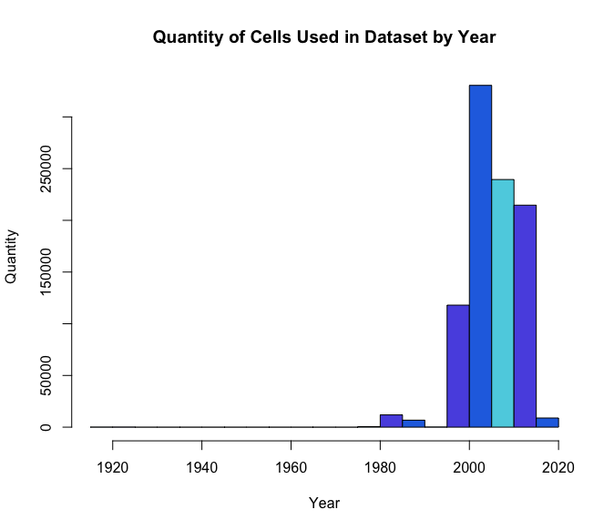
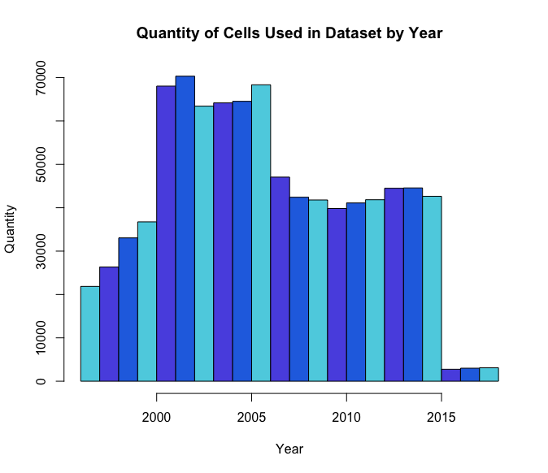
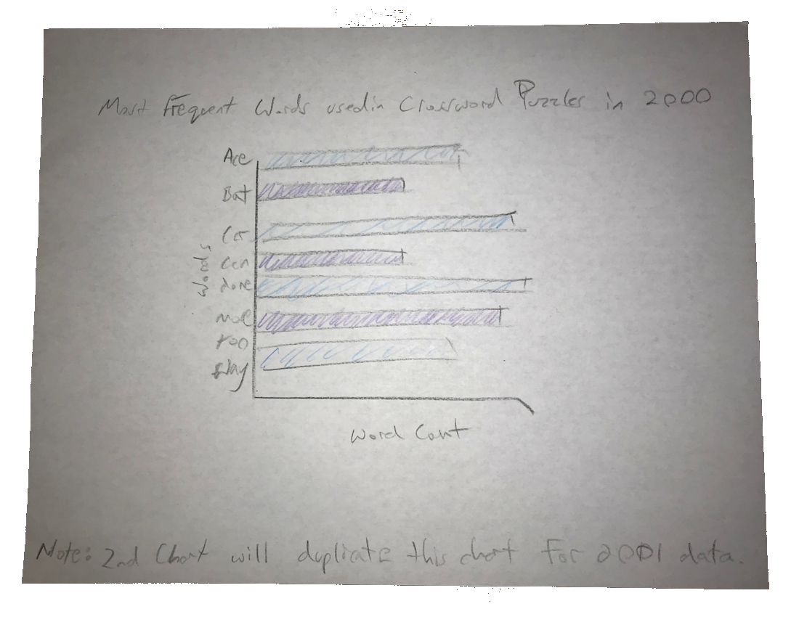

Homework 7: 2nd Dataset, Specific Questions, Proposed Charts
================
Peter Mavronicolas
11/30/2021

## Description of the EDA Process

**Generate Questions about your Data**

When brainstorming about questions I wanted to solve about my data, they
are entirely oriented around what the Crossword Enthusiast would want to
use as a tool to assist them in solving a Crossword Puzzle. Simply put,
I created questions that somebody solving a Crossword Puzzle would be
delighted to have answered.

**Search for answers by visualizing, transforming, and modeling your
data**

I began to model the data with a histogram of the “clues.csv” dataset
and transformed the data into top words used in Crossword Puzzles by
year. Ultimately, the most relevant data I find will be the newest
available to a reader unless the Cruciverbalist decided to design the
Puzzle with historical words in mind.

**Use what you learn to refine your questions and/or generate new
questions**

After several attempts at creating questions to visualize data from
modified datasets, I ultimately concluded that it would be in the best
interests of the user of the visualization idioms (also known as the
Crossword Enthusiast or Solver of Crossword Puzzles) to refine questions
that help the Crossword Enthusiast solve Crossword Puzzles.

**Description of your Datasets**

The datasets are a collection of some of the most popular Crossword
Puzzles waiting to be solved. These Puzzles are designed by popular
Crossword Puzzles gathered by the Author. For the most part, they
contain a date, clue and answer to published Crossword Puzzles. Some
datasets are organized in columns and rows while others are listed in a
document that is difficult to edit.

## Second Data Source Link

    https://xd.saul.pw/data/

All of the datasets that were found through the link above were explored
and a few of the subfolders were viewed. The data itself containing the
clues and answers to many popular news publications were present but the
format in which to extract and organize the data is beyond the scope of
this courses. I made several attempts to individually create the dataset
in an excel spreadsheet but found that I would have to copy each word
one by one and paste them into individual cells. This process would take
a little over eight days without any breaks or sleep (700,000 columns x
3 seconds per copy & paste / (60 seconds x 60 minutes x 24 hours)).
Therefore, I decided to work with the data that was already organized
into a .tsv file in the source link. I then converted it to a .csv file
and imported “clues.csv” into R Studio.

## Link to the Original Source of the Data

There is no cited link to the original source of data which is referred
to as “daily crosswords from several sources” by the author. It is,
however, mentioned that the author collected the data himself by
extracting data from individual crossword puzzles the Author chose to
collect data from. Based on similar.zip files created by the author and
the names of those files and the data within them, the original sources
were Crossword Puzzles created by New York World, New York Times, New
York Herald, LA Times, Eltana, Boston Globe and B.E. Quigley.

## Explore the Data, Additional Questions

The first step in exploring the data is to import the dataset into the
project. I dragged the downloaded file into the Project folder on my
Desktop and began to read the data.

    CROSSWORD2 <- read.csv("clues.csv", stringsAsFactors = FALSE)

Next, I was unable to immediately explore the data in a simple histogram
so I converted the dataset into a list in order to view any gaps in the
data. The histogram was then used to identify the number of cells with
data by year.

     CROSSWORD2.TABLE <- list()
     hist(CROSSWORD2$year[CROSSWORD2$year>1900], main="Quantity of Cells Used in Dataset by Year", horizontal=FALSE, xlab="Year",     
     ylab="Quantity", col= c("#5BD1E2","#5B57E2","#2571E2"))

I noticed that the the vast majority of data present was gathered from
1995-2019 so I filtered the years from 1995 to 2019.

      hist(CROSSWORD2$year[CROSSWORD2$year>1995], main="Quantity of Cells Used in Dataset by Year", horizontal=FALSE, xlab="Year", 
      ylab="Quantity", col= c("#5BD1E2","#5B57E2","#2571E2"))

Now that I determined which years the bulk of the data was located in, I
concentrated on visualizing the words themselves rather than individual
letters which resulted in few interesting findings.

## Final Detailed Questions

The following are the original questions submitted in Homework 6:

-   Why is the letter “X” used at a higher rate in the month of
    February?

-   Why is the letter “Q” used at a higher rate in the month of October?

After my initial analysis of the visualization idioms used to show the
occurrence of the letters “X” and “Q” by month, the data remained
relatively consistent with only one month as a slight exception. After
receiving valuable input from my Professor on the direction I should
take, I decided to gather data on the occurrence of specific words used
in Crossword Puzzles that had the greatest frequency by year. Since “X”
and “Q” were not included in the list of top twenty most frequently used
words, I decided to use the letters “A” and “E”. This lead me to my
final detailed questions:

-   Which words that begin with the letter “A” or “E” occur most often
    in Crossword Puzzles between 2000 annd 2001?

-   What are the most frequently used words in Crossword Puzzles over
    the past 25 years?

## Images of my Sketches

## Explanations of the charts

The chart used for the year 2000 and 2001 will clearly show which words
are used most frequently in Crossword Puzzles from the period 1995 to
2019. There are limitations to my datasets which limit me to expanding
on any elaborate theories as to why certain words are used in greater
detail than others. The simple fact is that the English language evolves
over time to where society uses more words than others. Put simply, the
charts show words that are most commonly used in Crosswords from 1995 to
2019 which can be used by Cruciverbalists to create Crossword Puzzles as
well as by Crossword enthusiasts who enjoy solving them. Any enthusiast
that seeks additional clues to solve a puzzle may utilize these charts
as a reference for words with the greatest probability to occur.

## Reference

-   Download Crossword Data, <https://xd.saul.pw/data/>

-   Calling Bullshit, <https://www.callingbullshit.org/index.html>, UW
    iSchool: YouTube,
    <https://www.youtube.com/channel/UCFdfsaSlsyTAYJvktJ53Qcg>

-   Google Books Ngram Viewer, <https://books.google.com/ngrams/>

-   R Markdown Basics, <https://rpubs.com/Rtudes/RMarkdownBasics>
 
